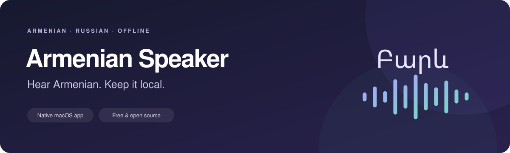

<p align="center">
  
</p>

<p align="center">
  <a href="https://github.com/Dronnn/hay-reader/releases/latest"></a>
  
  
  <a href="LICENSE"></a>
</p>

<h3 align="center">A desktop companion for learning Eastern Armenian.</h3>
<p align="center">Listen to Armenian. Slow it down. Translate a phrase. Keep your text on your Mac.</p>
<p align="center">
  <strong><a href="https://github.com/Dronnn/hay-reader/releases/latest">Download for Mac</a></strong>
  &nbsp; · &nbsp; <a href="https://armenian.mrmaier.com/speaker.html">Installation guide</a>
  &nbsp; · &nbsp; <a href="#build-from-source">Build from source</a>
  &nbsp; · &nbsp; <a href="#по-русски">По-русски</a>
</p>

---

## Why Armenian Speaker?

Practise a sentence at your own pace without switching to an online translator or a speech service. Armenian Speaker is a native SwiftUI macOS app with a bundled Armenian voice and local Armenian–Russian translation.

**Free to use. No account, API key, subscription, or internet connection needed after download.**

| Listen | Translate | Stay in your workflow |
| :--- | :--- | :--- |
| Eastern Armenian **Gor** voice | Russian to Armenian and Armenian to Russian | Selected text from Safari and TextEdit through macOS Services |
| **0.1×–2.0×** speed, in **0.1×** steps | Automatic translation after a **600 ms** typing pause | **Speak Clipboard** from the menu bar |
| Pause, resume, stop, and cached audio | Manual **Translate** for a selection or the whole editor | UTF-8 `.txt` import and an optional 20-phrase history |

## Install

**Requires an Apple Silicon Mac (M1 or newer) running macOS 14 or newer.** This release does not support Intel Macs, Windows, Linux, or iPhone.

1. Download the DMG from [the latest release](https://github.com/Dronnn/hay-reader/releases/latest). Version **1.0.2** is approximately **415 MB**, including all models.
2. Open the DMG and drag **Armenian Speaker** into **Applications**.
3. Launch the app and paste an Armenian phrase, such as `Բարև։`.

> **First launch:** this build is ad-hoc signed, without an Apple Developer ID signature or notarization. macOS may block it. If you trust this release, follow [Apple’s instructions](https://support.apple.com/en-us/102445) to allow it in **System Settings - Privacy & Security - Open Anyway** after attempting to launch it.

Release assets include `SHA256SUMS` and an archive of the application and matching GPL component sources. Run `shasum -a 256` on your downloaded DMG and compare its digest with `SHA256SUMS` to check the file.

## Everyday use

### Listen to Armenian

Paste Armenian into the editor and press **Play**. Select an Armenian fragment to hear just that part. Adjust the speed for the **next playback**; pause and resume the current recording whenever needed.

**Playback always chooses Armenian text.** Armenian in the editor takes priority. If the editor contains Russian and the lower panel contains its current Armenian translation, Play reads that translation. Russian and other non-Armenian letters are excluded from speech.

### Translate a phrase

Open the translation panel with the speech-bubble toolbar button and choose a direction. Translation starts **600 ms after you stop typing**. **Translate** runs it immediately, using the selected text when there is a selection.

The panel stays open until you close it. Closing it clears its result and stops scheduling translations. Use **Copy** to copy a result or **Use Text** to put it into the editor.

### Listen from another app

Select Armenian in Safari or TextEdit, then choose **Services - Speak Armenian** from that app’s menu. The text opens in Armenian Speaker; the **Automatically play text received from Services** setting controls whether playback starts immediately.

If the service is missing, launch your installed copy once and check **System Settings - Keyboard - Keyboard Shortcuts - Services - Text**. Availability depends on the source app. **Copy**, then **Speak Clipboard** in the menu bar, is the fallback.

### Keyboard shortcuts

| Shortcut | Action |
| :--- | :--- |
| `⌘ Return` | Play Armenian text |
| `⌘ .` | Stop |
| `⌘ K` | Clear the editor |
| `Space` outside editable text | Pause or resume |

## Local models, honest limits

| Task | Bundled model | Native engine | Model license |
| :--- | :--- | :--- | :--- |
| Armenian speech | [Gor · hy_AM-gor-medium](https://huggingface.co/davit312/piper-TTS-Armenian) | Piper + ONNX Runtime + espeak-ng | GPL-2.0 |
| Russian to Armenian | [WindyEnhanced herm0 · INT8](https://huggingface.co/WindstormLabs/translate-ru-hy) | CTranslate2 + SentencePiece | CC-BY-4.0 |
| Armenian to Russian | [SMaLL-100](https://huggingface.co/alirezamsh/small100), [INT8 conversion](https://huggingface.co/luonluonvn/small100_ct2_quant_int8) | CTranslate2 + SentencePiece | MIT |

Speech and translation can make mistakes, including on short everyday phrases. Treat translations as study aids and check important wording. Translation accepts up to roughly **450 tokenizer pieces per request**; select a shorter passage for longer text.

There is **no microphone transcription, English translation, or Russian speech output** in this version. Piper generates speech; it does not recognize your voice.

## Privacy and storage

The installed app performs speech and translation locally, with **no analytics or cloud API calls**. Models ship inside the app; the voice is also installed in Application Support on first use.

- **History:** the latest 20 spoken phrases, stored locally. Turn off **Keep phrase history** to erase stored phrases and stop saving new ones, or use **Clear History**.
- **Audio cache:** local WAV files in `~/Library/Caches/Armenian Speaker/Audio`. Choose a budget in Settings; old recordings are pruned. A single active recording can exceed the budget.
- **Voice files:** `~/Library/Application Support/Armenian Speaker/Models`.

Models account for most of the download size. Building from source also downloads native dependencies; those downloads happen during the build, not normal app use.

## Build from source

You need an Apple Silicon Mac, **Xcode**, Git, and **CMake**. The current release was built with Xcode 26 and tested on macOS 26.6.2; the app’s deployment target is macOS 14.

```sh
git clone https://github.com/Dronnn/hay-reader.git
cd hay-reader
brew install cmake
./script/build_and_run.sh --verify
```

The `brew` command assumes [Homebrew](https://brew.sh) is installed. Alternatively, open `hay-read/hay-read.xcodeproj` in Xcode and run the `hay-read` scheme on **My Mac**.

The first build downloads pinned native sources and translation model revisions, verifies model checksums, and builds the native libraries. Allow time and several GB of free space. Subsequent builds reuse `.local/`. **No Python runtime, local server, or external model manager is required.** Signing defaults to ad-hoc.

<details>
<summary><strong>Tests, packaging, and project layout</strong></summary>

Run the tests:

```sh
xcodebuild \
  -project hay-read/hay-read.xcodeproj \
  -scheme hay-read \
  -derivedDataPath "${TMPDIR:-/tmp}/hay-reader-build" \
  -only-testing:hay-readTests test
```

For Release tests, add `-configuration Release ENABLE_TESTABILITY=YES`.

Version 1.0.2 passed **9 tests in Debug and Release**, including native speech at 0.1×, 0.5×, 0.7×, 1× and 2×, caching, Armenian text selection, translation in both directions, and automatic translation scheduling. These check functionality, not overall linguistic accuracy. macOS 14 is the deployment target, not the OS used for those test runs.

Create a DMG with `./script/package.sh`. The result is placed in `dist/`. Build helpers keep DerivedData in the temporary directory to avoid signing problems caused by extended attributes in synced Documents folders.

| Path | Purpose |
| :--- | :--- |
| `hay-read/hay-read/` | SwiftUI app, editor, player, history, and native service wrappers |
| `hay-read/hay-readTests/` | Functional tests |
| `native/` | C++ translation bridge, model checksums, and license notices |
| `script/` | Dependency preparation, build, run, and packaging |
| `.local/` | Generated dependency and model cache; ignored by Git |
| `dist/` | Generated release artifacts; ignored by Git |

After building, `.local/` and temporary DerivedData can be removed to recover space. The next build will recreate them. An already packaged app contains its own runtime and models.

</details>

## Feedback and contributions

[Report a bug or suggest an improvement](https://github.com/Dronnn/hay-reader/issues). Include the app version, macOS version, Mac chip, and steps to reproduce. For translation issues, include a short non-sensitive input, the selected direction, the actual result, and the expected wording.

Pull requests are welcome. Keep changes focused, preserve offline operation, and run the relevant checks. Do not commit private text, credentials, model weights, build outputs, or logs.

If Armenian Speaker makes your practice easier, **a star helps other Armenian learners find it**. Share it with someone learning the language, or explore the [Eastern Armenian course](https://armenian.mrmaier.com).

## License and credits

Application source is licensed under [GNU GPL v3](LICENSE). Bundled components and models retain their own licenses, including Piper and espeak-ng under GPL-3.0, ONNX Runtime and CTranslate2 under MIT, and SentencePiece under Apache-2.0.

Thanks to the Gor voice publisher, OHF-Voice/Piper, espeak-ng, Microsoft ONNX Runtime, OpenNMT/CTranslate2, Google SentencePiece, the SMaLL-100 authors and INT8 converter, and WindstormLabs / WindyWord.ai for the Russian–Armenian model. See [component credits and notices](native/licenses/NOTICE); bundled license texts are also accessible through **Settings - Open Licenses**.

## По-русски

**Armenian Speaker** — бесплатное приложение для Mac с Apple Silicon и macOS 14+. Озвучивает армянский голосом Gor и переводит между русским и армянским без интернета, аккаунтов и API-ключей. Все модели уже внутри приложения.

[Скачать приложение](https://github.com/Dronnn/hay-reader/releases/latest) · [Инструкция по установке](https://armenian.mrmaier.com/speaker.html)

Озвучка выбирает армянский текст из редактора или актуального перевода в нижней панели. Скорость — от 0.1× до 2.0× с шагом 0.1×. Открытая панель переводит через 0,6 секунды после паузы ввода; закрытая не запускает перевод. Кнопка **Translate** запускает перевод сразу.

Перевод и произношение могут содержать ошибки. Распознавания голоса и перевода на английский пока нет. Сборка не нотарифицирована Apple; порядок первого запуска описан в инструкции. Если приложение полезно, поддержите его звёздочкой или поделитесь с теми, кто учит армянский.
